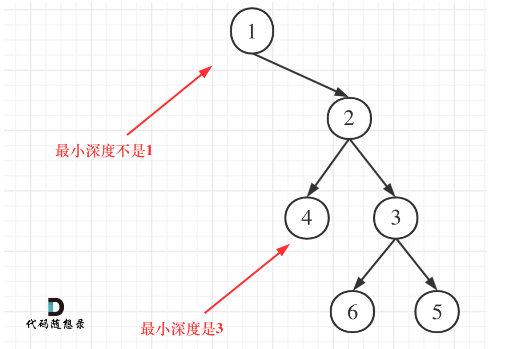

# 代码随想录算法训练营74期|二叉树part02

## Leetcode题目
| 题目     | Leetcode地址 |
| ----------- | ----------- |
| 226. 翻转二叉树| [力扣题目链接](https://leetcode.cn/problems/invert-binary-tree/description/)    |
| 101. 对称二叉树| [力扣题目链接](https://leetcode.cn/problems/symmetric-tree/description/)      |
| 559. N叉树的最大深度| [力扣题目链接](https://leetcode.cn/problems/maximum-depth-of-n-ary-tree/description/)      |
| 104. 二叉树的最大深度| [力扣题目链接](https://leetcode.cn/problems/maximum-depth-of-binary-tree/description/)      |
| 111. 二叉树的最小深度| [力扣题目链接](https://leetcode.cn/problems/minimum-depth-of-binary-tree/description/)      |


## 226.翻转二叉树（视频详解）

遍历顺序很重要：
前序或者后续的写法
递归三部曲：
1. 确定返回值和参数：
返回值：二叉树的节点
参数：传入的根节点
2. 确定终止条件：
```python
if root == None:
    return root
```
3. 单层的处理逻辑
前序：中左右：
```python
swap(root.left, root.right)
invertTree(root.left)
invertTree(root.right)
```
后序也可以
中序为什么不行：
```python
invertTree(root.left)
swap(root.left, root.right)
invertTree(root.right)
```
这样交换后，left就变成right了因此，只是进行了两次左子树的交换，从而会产生错误
中序遍历就可以写成：
```python
invertTree(root.left)
swap(root.left, root.right)
invertTree(root.left)
```

## 101.对称二叉树
1. 返回值和参数：
返回值：True or False
参数：root
2.终止条件：
```python
if root.left == None or root.right == None:
    return True or False
```
3.单层逻辑：
```python
flag = travelTree(root.right) and travel(root.left)
```
## 改正：
我们要判断的是是否对称，而不是是否值完全相等，所以比较的应该是两个子树
1. 参数应该是:root.left和root.right
2. 终止条件：
   因为处理的是子树，所以要判断子树是否为空：
```python
f (left == NULL && right != NULL) return false;
else if (left != NULL && right == NULL) return false;
else if (left == NULL && right == NULL) return true;
else if (left->val != right->val) return false; // 注意这里我没有使用else
```
3. 单层逻辑：
外和外比、内和内比
```python
outsame = compare(left.left, right.right)
insidesame = compare(left.right, right.left)
return outsame and insidesame
```

104.二叉树的最大深度

- 二叉树节点的深度：指从根节点到该节点的最长简单路径边的条数或者节点数（取决于深度从0开始还是从1开始）
- 二叉树节点的高度：指从该节点到叶子节点的最长简单路径边的条数或者节点数（取决于高度从0开始还是从1开始）

1. 参数和返回值
返回值为深度
参数为节点
2.空节点返回0
3.左子树的深度，右子树的深度最大值加1

105.二叉树的最小深度
本题的逻辑在于，单次的处理逻辑

也就是说，我们要找到叶子节点来记录最小值

如果还和最大深度那么写的话，就会出现如下的误区：


因此，这个逻辑就不同了所以，如果左子树为空，右子树不为空，说明最小深度是 1 + 右子树的深度。

反之，右子树为空，左子树不为空，最小深度是 1 + 左子树的深度。 最后如果左右子树都不为空，返回左右子树深度最小值 + 1 。