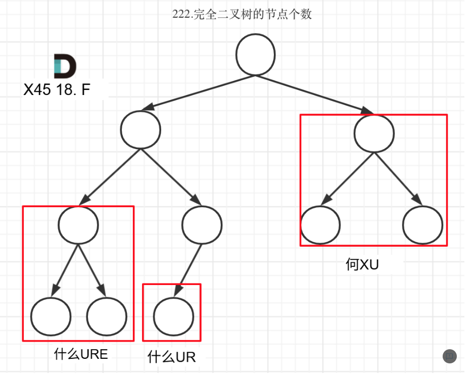

# 代码随想录算法训练营74期|二叉树part03

## Leetcode题目
| 题目     | Leetcode地址 |
| ----------- | ----------- |
| 110.平衡二叉树| [力扣题目链接](https://leetcode.cn/problems/balanced-binary-tree/description/)    |
| 257. 二叉树的所有路径| [力扣题目链接](https://leetcode.cn/problems/binary-tree-paths/description/)      |
| 404. 左叶子之和| [力扣题目链接](https://leetcode.cn/problems/sum-of-left-leaves/description/)      |
| 222. 完全二叉树的节点个数| [力扣题目链接](https://leetcode.cn/problems/count-complete-tree-nodes/description/)      |

今天的题目还是二叉树递归的各种应用，比较有趣的是222题，
利用完全二叉树和满二叉树的性质
递归着去找每一个子满二叉树，利用其性质返回相应的节点数。

self.result.append('->'.join(map(str, path))) # 注意这里，path算是公共变量，在每个递归栈中共享空间，map可以进行类型转换