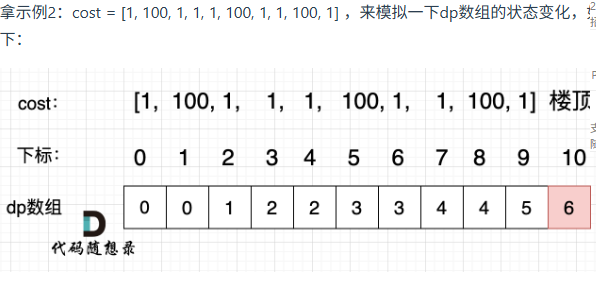

# 代码随想录算法训练营74期|动态规划part01

## 理论基础

### 什么是动态规划

Dynamic Programming(DP),如果有某一问题有很多重叠的子问题，那么动态规划是最有效的。
也就是说，**动态规划的每一个状态是由上一个状态推导出来的**，这一点就区别于贪心算法。贪心没有状态推导，而是从局部选择最优

### 动态规划的解题步骤

动态规划必须搞清楚的五部曲：
- 确定dp数组以及下标的含义
- 确定递推公式
- dp数组如何初始化
- 确定遍历顺序
- 举例推导dp数组

### 动态规划如何debug

最好的方法是打印dp数组，然后与自己的思路做对照。
做动规的题目，写代码之前一定要把状态转移在dp数组的上具体情况模拟一遍，心中有数，确定最后推出的是想要的结果。

然后再写代码，如果代码没通过就打印dp数组，看看是不是和自己预先推导的哪里不一样。

**如果打印出来和自己预先模拟推导是一样的**，那么就是自己的递归公式、初始化或者遍历顺序有问题了。

**如果和自己预先模拟推导的不一样**，那么就是代码实现细节有问题。

## 题目

| 题目     | Leetcode地址 |
| ----------- | ----------- |
| 509.斐波那契数| [力扣题目链接](https://leetcode.cn/problems/fibonacci-number/description/)      |
|70.爬楼梯| [力扣题目链接](https://leetcode.cn/problems/climbing-stairs/description/)        |
|746.使用最小花费爬楼梯|[力扣题目链接](https://leetcode.cn/problems/min-cost-climbing-stairs/description/)    |

### 509 斐波那契数

1. dp数组的意义：dp[i]表示第i个斐波那契的值
2. 递推公式：由斐波那契数列的定义可知：dp[i] = dp[i - 1] + dp[i - 2]
3. dp数组初始化：dp[0] = 0, dp[1] = 1
4. 遍历顺序，从前向后，每个数需要前两个数
5. 举例：n = 3 dp[2] = 0 + 1, dp[3] = dp[2] + dp[1] = 2

### 70.爬楼梯

1. dp数组的意义：dp[i]表示爬到第i个阶梯有几种方法
2. 递推公式：dp[i] = dp[i - 1] + dp[i - 2]，因为要想上到第i阶的最后一步要么迈一步，要么迈两步
3. dp数组初始化：dp[0] = 0,dp[1] = 1,dp[2] = 2
4. 遍历顺序，从前向后
5. 举例：n = 3:dp[3] = dp[1] + dp[2] = 3

### 746.使用最小花费爬楼梯

1. dp数组的意义：dp[i]表示爬到第i个台阶需要的最小花费
2. 递推公式：爬到第i个台阶，从i-2 + i - 2的花费或者从i - 1 + i-1的花费，即：dp[i] = min((dp[i - 2] + cost[i - 2]), (dp[i - 1] + cost[i - 1]))
3. dp数组初始化，前两个台阶不要钱
4. 遍历顺序，从前向后
5. 举例：
