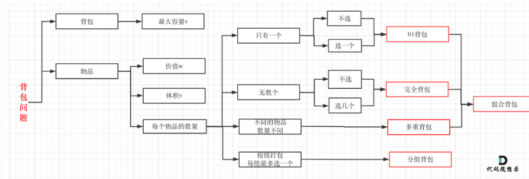
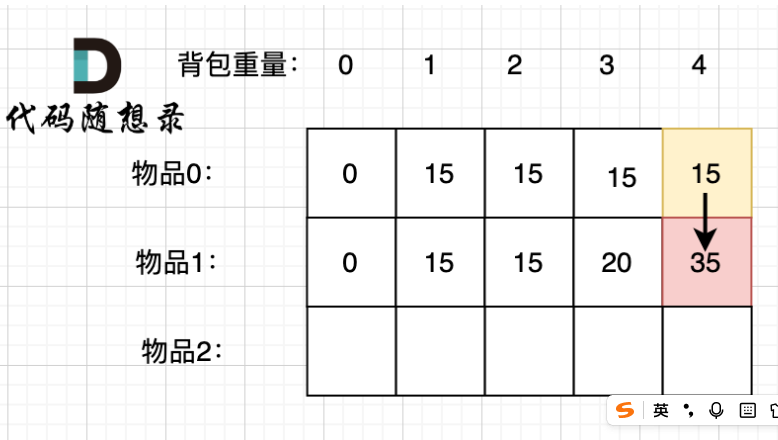
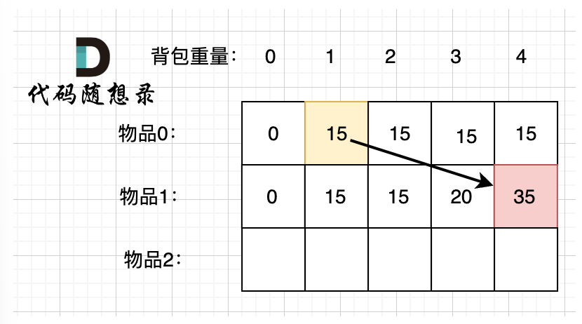
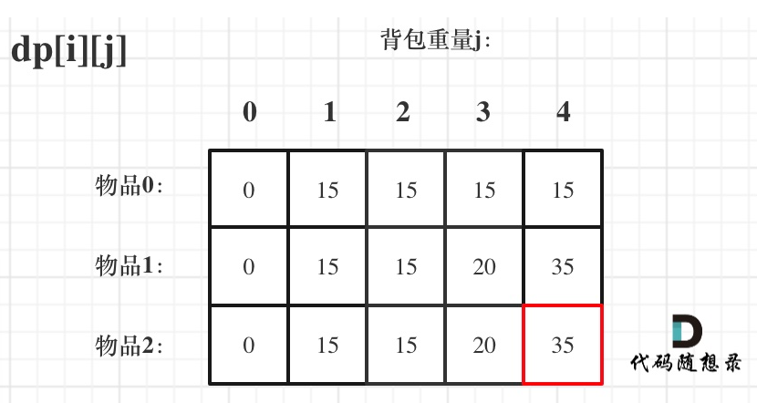
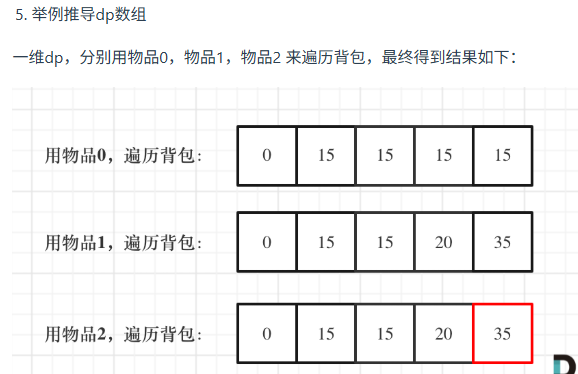

# 代码随想录算法训练营74期|动态规划part03
## 题目
| 题目     | Leetcode地址 |
| ----------- | ----------- |
|46.携带研究材料| [卡码题目链接](https://kamacoder.com/problempage.php?pid=1046)      |
|416.分割等和子集| [力扣题目链接](https://leetcode.cn/problems/partition-equal-subset-sum/description/)      |

## 0/1背包

背包问题分为很多种类，如图：

除此以外其他类型的背包，面试几乎不会问，都是竞赛级别的了，leetcode上连多重背包的题目都没有，所以题库也告诉我们，01背包和完全背包就够用了。

而完全背包又是也是01背包稍作变化而来，即：完全背包的物品数量是无限的。

### 0/1背包的描述

有n件物品和一个最多能背重量为w的背包。第i件物品的重量是weight[i]，得到的价值是value[i]，**每件物品只能使用一次**。求解将哪些物品装入背包的物品价值总和最大。

习惯性想到了背包，那么暴力的解法应该是怎么样的呢？
每一件物品其实只有两个状态，取或者不取，所以可以使用回溯法搜索出所有的情况，那么时间复杂度就是O(2^n)，这里的n表示物品数量。

**所以暴力的解法是指数级别的时间复杂度。进而才需要动态规划的解法来进行优化！**

#### 二维dp数组01背包

1. 确定dp数组以及下标的含义：

为什么使用二维数组，因为有两个维度需要表示：物品和背包容量
**dp[i][j]表示：从[0-i]的物品里任意取，放进容量为j的背包，价值中和最大是多少**

2. 确定递推公式：
   要看从哪些方向可以推导出dp[i][j],拿dp[1][4]来说，有两种情况，放1还是不放1，不放1的话，价值应该是dp[0][4]:
   
   放1的话，那么就要留出物品1的容量，此时背包还剩下容量1
   所以此时的价值应该是dp[0][1],所以放物品1应该是dp[0][1] + 物品1
   
   所以，dp[1][4] = max(dp[0][4], dp[0][1] + value[1])
   所以，抽象出来：
   不放物品i：dp[i - 1][j]
   放物品[i] : dp[i - 1][j - weight[i]] + value[i]

   所以得到递推公式：
   dp[i][j] = max(dp[i - 1][j], dp[i - 1][j - weight[i]] + value[i])

3. dp如何初始化
  
  **一定要和dp数组的定义吻合，否则到递推公式的时候就会越来越乱。**
  首先从dp[i][j]的定义出发，如果背包容量j为0的话，即dp[i][0]，无论是选取哪些物品，背包价值总和一定为0。
  再看其他情况。
  通过状态转移方程可以看出i是由i-1推导出来，那么为0的时候就一定初始化。

  dp[0][j]，即：i为0，存放编号0的物品的时候，各个容量的背包所能存放的最大价值。

  那么很明显当 j < weight[0]的时候，dp[0][j] 应该是 0，因为背包容量比编号0的物品重量还小。

  当j >= weight[0]时，dp[0][j] 应该是value[0]，因为背包容量放足够放编号0物品。

4. 确定遍历顺序
   在如下图中，可以看出，有两个遍历的维度：物品与背包重量。dp[i-1][j]和dp[i - 1][j - weight[i]] 都在dp[i][j]的左上角方向（包括正上方向）

5. 举例推导dp数组

#### 一维01背包问题

上面是使用二维dp数组来进行计算的，下面将使用一维数组进行计算，即滚动数组，

二维数组时的递推公式：dp[i][j] = max(dp[i - 1][j], dp[i - 1][j - weight[i]] + value[i]);

**其实可以发现如果把dp[i - 1]那一层拷贝到dp[i]上，表达式完全可以是：dp[i][j] = max(dp[i][j], dp[i][j - weight[i]] + value[i]);**
不会影响后面的计算，因为是从上到下，从左到右的

与其把dp[i - 1]这一层拷贝到dp[i]上，不如只用一个一维数组了，只用dp[j]（一维数组，也可以理解是一个滚动数组）。
这就是滚动数组的由来，需要满足的条件是上一层可以重复利用，直接拷贝到当前层。

前面dp数组的定义是**从下标为[0-i]的物品里任意取，放进容量为j的背包，价值总和最大是多少。**

一维数组五部曲：
1. dp[j]表示容量为j的背包，所背物体的最大价值
2. dp[j] = max(dp[j], dp[j - weight[i]] + value[i])
   dp[j]可以通过dp[j - weight[i]]推导出来，dp[j - weight[i]]表示容量为j - weight[i]的背包所背的最大价值。
   dp[j - weight[i]] + value[i] 表示 容量为 [j - 物品i重量] 的背包 加上 物品i的价值。（也就是容量为j的背包，放入物品i了之后的价值即：dp[j]）
3. 一维dp数组初始化：
    dp数组在推导的时候一定是取价值最大的数，如果题目给的价值都是正整数那么非0下标都初始化为0就可以了。

    这样才能让dp数组在递归公式的过程中取的最大的价值，而不是被初始值覆盖了。

    那么我假设物品价值都是大于0的，所以dp数组初始化的时候，都初始为0就可以了
4. 遍历顺序
    这里发现和二维dp的写法中，遍历背包的顺序是不一样的！

    二维dp遍历的时候，背包容量是从小到大，而一维dp遍历的时候，背包是从大到小。

    为什么呢？**倒序遍历是为了保证物品i只被放入一次！**。但如果一旦正序遍历了，那么物品0就会被重复加入多次！

    举一个例子：物品0的重量weight[0] = 1，价值value[0] = 15

   如果正序遍历

    dp[1] = dp[1 - weight[0]] + value[0] = 15

    dp[2] = dp[2 - weight[0]] + value[0] = 30

    此时dp[2]就已经是30了，意味着物品0，被放入了两次，所以不能正序遍历。

    为什么倒序遍历，就可以保证物品只放入一次呢？

    倒序就是先算dp[2]

    dp[2] = dp[2 - weight[0]] + value[0] = 15 （dp数组已经都初始化为0）

    dp[1] = dp[1 - weight[0]] + value[0] = 15

    所以从后往前循环，每次取得状态不会和之前取得状态重合，这样每种物品就只取一次了。

    可以理解为如果从前往后，会被覆盖到这一层上
5. 举例推导：
   
   

