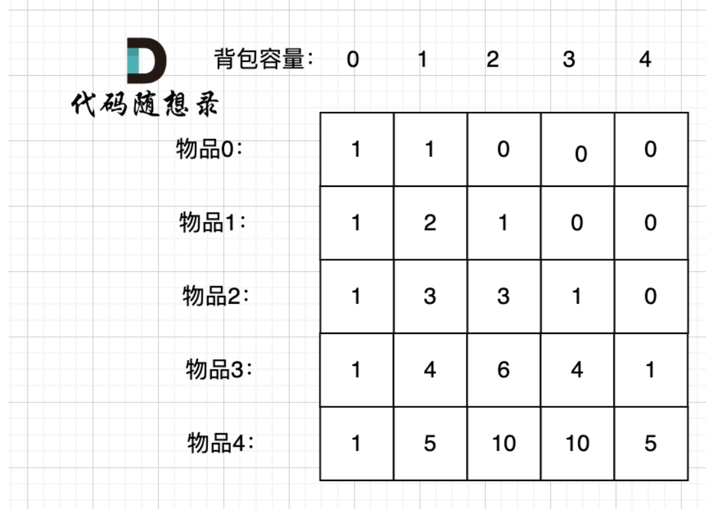

# 代码随想录算法训练营74期|动态规划part04

## 题目
| 题目     | Leetcode地址 |
| ----------- | ----------- |
|1049.最后一块石头的重量II| [力扣题目链接](https://leetcode.cn/problems/last-stone-weight-ii/description/)      |
|494.目标和| [力扣题目链接](https://leetcode.cn/problems/target-sum/)      |
|474.一和零| [力扣题目链接](https://leetcode.cn/problems/ones-and-zeroes/description/)      |

### 1049.最后一块石头的重量

本题的重点其实在于怎么转换为01背包的问题，昨天已经做过了分割数组的题，本题需要找到最小的重量，因此，应该要尽可能的拼成重量为sum/2的石头堆，从而找到最小的差

### 494.目标和

有加就有减，设加法的总和为x，减法对应的是sum - x
x - (sum - x) = target
x = (target + sum ) / 2
所以这题就变成了，在这个数组中加和为x的有几种选取方法
从而可以演化成背包问题：容量为x的背包，装满有几种装法，就和组合总和那题类似了，但是由于回溯法是指数级的时间复杂度，所以，本题会超时

于是，引入动态规划：

1. dp数组的含义：dp[i][j]表示：从[0-i]选，填满容量j有几种方法
2. 递推：可以先手动花几步，然后选中一个位置，看他是从哪里得出来的：
   比如，dp[2][2],表示容量为2，从0-2中选物品的方式，所以应该有两种情况：
   - 不放2：那就是dp[1][2]
   - 放2：那就应该留出2的大小来，也就是dp[1][2 - w[2]]
   最终应该是他们两个加起来
   所以，抽象出来应该是dp[i][j] = dp[i - 1][j] + dp[i - 1][j - w[i]]
3. 初始化：由上方和左上方推出。所以应该初始化第一列和第一行：
   dp[0][0] = 0（放0件物品）
   dp[0][j]只放0件物品，所以应该是dp[0][num[0]] = 1 其他全是0
   dp[i][0] = 1（一件都不放）
4. 遍历顺序：先遍历物品，再遍历容量
5. 模拟：
      

需要注意几个点：
1. 递推是相加，所以w[i] < j 的时候加，而不是两个取和
2. 如果目标和是0的时候，每有一个0，就可以加减一下，所以，dp[i][0]不应该都是0，应该根据0个个数来判断次数
3. 如果nums[i] < target_num时，第一行初始化才赋值为1

### 474.一和零

多重背包是每个物品，数量不同的情况。

本题中strs 数组里的元素就是物品，每个物品都是一个！

而m 和 n相当于是一个背包，两个维度的背包。

理解成多重背包的同学主要是把m和n混淆为物品了，感觉这是不同数量的物品，所以以为是多重背包。

但本题其实是01背包问题！

只不过这个背包有两个维度，一个是m 一个是n，而不同长度的字符串就是不同大小的待装物品。

动归五部曲：

1. dp的含义：dp[i][j]：最多有i个0和j个1的strs的最大子集的大小为dp[i][j]。
2. dp[i][j] 可以由前一个strs里的字符串推导出来，strs里的字符串有zeroNum个0，oneNum个1。

dp[i][j] 就可以是 dp[i - zeroNum][j - oneNum] + 1。

然后我们在遍历的过程中，取dp[i][j]的最大值。

所以递推公式：dp[i][j] = max(dp[i][j], dp[i - zeroNum][j - oneNum] + 1);

此时大家可以回想一下01背包的递推公式：dp[j] = max(dp[j], dp[j - weight[i]] + value[i]);

对比一下就会发现，字符串的zeroNum和oneNum相当于物品的重量（weight[i]），字符串本身的个数相当于物品的价值（value[i]）。
3. dp数组如何初始化
01背包的dp数组初始化为0就可以。因为物品价值不会是负数，初始为0，保证递推的时候dp[i][j]不会被初始值覆盖
4. 可以看出这个是滚动数组，虽然是二维的，是因为他有两个维度的容量，如果使用二维的方法，那么应该是三维数组
5. 模拟

## 总结

此时使用了0-1背包的多种应用，

纯 0 - 1 背包 (opens new window)是求 给定背包容量 装满背包 的最大价值是多少。
416. 分割等和子集 (opens new window)是求 给定背包容量，能不能装满这个背包。
1049. 最后一块石头的重量 II (opens new window)是求 给定背包容量，尽可能装，最多能装多少
494. 目标和 (opens new window)是求 给定背包容量，装满背包有多少种方法。
474. 一和零 给定背包容量，装满背包最多有多少个物品（二维容量的01背包）。