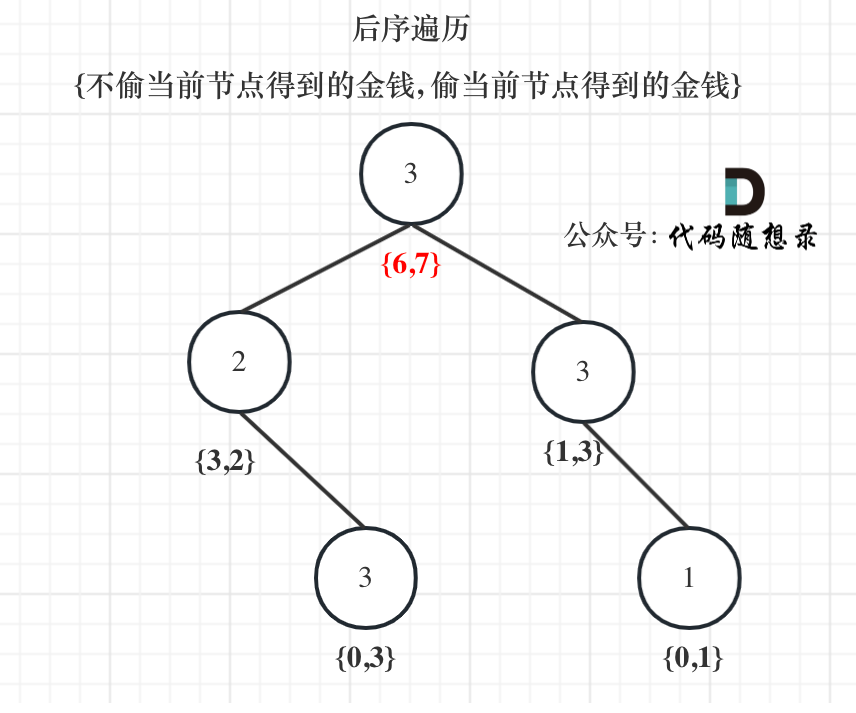

# 代码随想录算法训练营74期|动态规划part07

打家劫舍

## 题目
| 题目     | Leetcode地址 |
| ----------- | ----------- |
|198.打家劫舍| [力扣题目链接](https://leetcode.cn/problems/house-robber/description/)      |
|213.打家劫舍II| [力扣题目链接](https://leetcode.cn/problems/house-robber-ii/description/)      |
|337.打家劫舍III| [力扣题目链接](https://leetcode.cn/problems/house-robber-iii/)      |

### 198.打家劫舍

1. dp[j]:从0-j家，偷取的最大值是dp[j]
2. 对于第j家，如果偷j，那么当前的价值应该是dp[j - 2] + v[j].如果不偷j家，就应该是dp[j - 1]
3. 初始化，dp[0] = value[0] dp[1] = max(value[0], value[1])
4. 遍历顺序：从左向右
5. 验证：草稿纸

### 279.打家劫舍II

这道题目和198.打家劫舍 (opens new window)是差不多的，唯一区别就是成环了。

对于一个数组，成环的话主要有如下三种情况：
- 情况一：考虑不包含首尾元素
- 情况二：考虑包含首元素，不包含尾元素
- 情况三：考虑包含尾元素，不包含首元素
注意我这里用的是"考虑"，例如情况三，虽然是考虑包含尾元素，但不一定要选尾部元素！ 对于情况三，取nums[1] 和 nums[3]就是最大的。

而情况二 和 情况三 都包含了情况一了，所以只考虑情况二和情况三就可以了。

### 337.打家劫舍III

对于树的话，首先就要想到遍历方式，前中后序（深度优先搜索）还是层序遍历（广度优先搜索）。

**本题一定是要后序遍历，因为通过递归函数的返回值来做下一步计算。**
与198.打家劫舍，213.打家劫舍II一样，关键是要讨论当前节点抢还是不抢。

如果抢了当前节点，两个孩子就不能动，如果没抢当前节点，就可以考虑抢左右孩子（注意这里说的是“考虑”）

而动态规划其实就是使用状态转移容器来记录状态的变化，这里可以使用一个长度为2的数组，记录当前节点偷与不偷所得到的的最大金钱。

**这道题目算是树形dp的入门题目，因为是在树上进行状态转移，我们在讲解二叉树的时候说过递归三部曲，那么下面我以递归三部曲为框架，其中融合动规五部曲的内容来进行讲解。**

1. 确定递归函数的参数和返回值
这里我们要求一个节点 偷与不偷的两个状态所得到的金钱，那么返回值就是一个长度为2的数组。

参数为当前节点

其实这里的返回数组就是dp数组。

所以dp数组（dp table）以及下标的含义：下标为0记录不偷该节点所得到的的最大金钱，下标为1记录偷该节点所得到的的最大金钱。

所以本题dp数组就是一个长度为2的数组！

那么有同学可能疑惑，长度为2的数组怎么标记树中每个节点的状态呢？

**别忘了在递归的过程中，系统栈会保存每一层递归的参数。**

2. 确定终止条件：
   空指针，直接返回{0， 0}，这也相当于dp数组的初始化
3. 确定遍历顺序
首先明确的是使用后序遍历。 因为要通过递归函数的返回值来做下一步计算。
通过递归左节点，得到左节点偷与不偷的金钱。
通过递归右节点，得到右节点偷与不偷的金钱。

4. 确定单层递归的逻辑
   如果是偷当前节点，那么左右孩子就不能偷，val1 = cur->val + left[0] + right[0]; （如果对下标含义不理解就再回顾一下dp数组的含义）

    如果不偷当前节点，那么左右孩子就可以偷，至于到底偷不偷一定是选一个最大的，所以：val2 = max(left[0], left[1]) + max(right[0], right[1]);

    最后当前节点的状态就是{val2, val1}; 即：{不偷当前节点得到的最大金钱，偷当前节点得到的最大金钱}
5. 举例：
    
 
