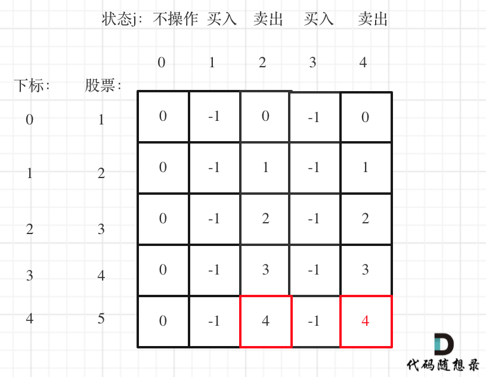

# 代码随想录算法训练营74期|动态规划part08

买股票

## 题目
| 题目     | Leetcode地址 |
| ----------- | ----------- |
|121.买股票的最佳时机| [力扣题目链接](https://leetcode.cn/problems/best-time-to-buy-and-sell-stock/description/)      |
|122.买卖股票的最佳时机II| [力扣题目链接](https://leetcode.cn/problems/best-time-to-buy-and-sell-stock-ii/description/)      |
|123.买卖股票的最佳时机III| [力扣题目链接](https://leetcode.cn/problems/best-time-to-buy-and-sell-stock-iii/description/)      |

### 121.买股票的最佳时机

只能买卖一次，因此，可以使用贪心，向左找最小，向右找最大

也可以用动态规划

1. dp[i][0] 表示第i天持有股票所得最多现金 ，这里可能有同学疑惑，本题中只能买卖一次，持有股票之后哪还有现金呢？

   其实一开始现金是0，那么加入第i天买入股票现金就是 -prices[i]， 这是一个负数。

   dp[i][1] 表示第i天不持有股票所得最多现金
2. 递推式：dp[i][0]:第i天持有股票：i - 1天前就已经买入；第i天买入，所以，那么dp[i][0]应该选所得现金最大的，所以dp[i][0] = max(dp[i - 1][0], -prices[i]);
          dp[i][1]:第i天不持有股票：i - 1天前就卖出；第i天卖出，所以，dp[i][1]应该选择现金最大的，所以dp[i][1] = max(dp[i - 1][1], dp[i - 1][0] + prices[i])
3. 初始化：dp[0][0]:第0天持有股票：dp[0][1] = -price[0], :第0天不持有股票 dp[0][1] = 0
4. 遍历顺序：从前向后
5. 模拟

构造数组
```python
dp = [[0] * col for _ in range(row)]
```

### 122.买卖股票的最佳时机II

1. dp[i][0] 表示第i天持有股票所得最多现金 ，这里可能有同学疑惑，本题中只能买卖一次，持有股票之后哪还有现金呢？
   dp[i][1] 表示第i天不持有股票所得最多现金

2. 递推式： dp[i][0]:之前就买入：dp[i - 1][0],当天买入：i-1天前就不持有 **dp[i - 1][1] - price[i]**多次买入，这就是和上面的区别
           dp[i][1]:之前就卖出：dp[i - 1][1],当天卖出：i-1天前持有dp[i - 1][0] + price[i]
3. 初始化：dp[0][0]:第0天持有股票：dp[0][1] = -price[0], :第0天不持有股票 dp[0][1] = 0
4. 遍历顺序：从前向后
5. 模拟

### 123.买卖股票的最佳时机III

1. dp数组应该有几个状态的最大收益：
   0:没有操作
   1：第一次持有
   2：第一次不持有
   3：第二次持有
   4：第二次不持有
2. 递推：
   1:
        dp[i][1]: dp[i-1][0] - prices[i]
        dp[i][1]: dp[i-1][1]
    2:
        dp[i][2]: dp[i-1][2]
        dp[i][2]: dp[i-1][1] + price[i]
    3:
        dp[i][3]: dp[i-1][3]
        dp[i][3]: dp[i-1][2] - price[i]
    4:
        dp[i][4]: dp[i-1][4]
        dp[i][4]: dp[i-1][3] + price[i]
3. 初始化：
    因为i由i-1得出，所以初始化第一天的
    dp[0][0]: 没操作 0
    dp[0][1]: 第一次持有-price[0]
    dp[0][2]: 第一次不持有0
    dp[0][3]: 第二次持有-price[0]
    dp[0][4]: 第二次不持有0
4. 遍历顺序，从前到后
5. 模拟
 