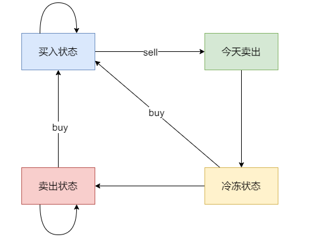

# 代码随想录算法训练营74期|动态规划part08

买股票

## 题目
| 题目     | Leetcode地址 |
| ----------- | ----------- |
|188.买股票的最佳时机IV| [力扣题目链接](https://leetcode.cn/problems/best-time-to-buy-and-sell-stock-iv/)      |
|309.买卖股票的最佳时机含冷冻期| [力扣题目链接](https://leetcode.cn/problems/best-time-to-buy-and-sell-stock-with-cooldown/)      |
|714.买卖股票的最佳时机含手续费| [力扣题目链接](https://leetcode.cn/problems/best-time-to-buy-and-sell-stock-with-transaction-fee/description/)      |

### 188.买股票的最佳时机IV

1. 这题就是III的进阶版，可以执行k次交易：那我们就定义k个状态
   0:没有操作
   1：第一次持有
   2：第一次不持有
   3：第二次持有
   4：第二次不持有
   ...
   2k-1:第k次持有
   2k:第k次不持有
   我们发现，奇数就是持有，偶数就是不持有
2. 递推：
   dp[i][k]:如果k是奇数：持有，应该是max(dp[i - 1][k], dp[i - 1][k - 1] - price[i])
   dp[i][k]:如果k是偶数：不持有，应该是max(dp[i - 1][k], dp[i - 1][k - 1] + price[i])
3. 初始化：
   可以看出，第i行都是通过i-1行推出来的，所以应该初始化第一行，所有奇数列都是-price[0]，偶数列是0
4. 遍历顺序：从前向后
5. 模拟：草稿纸

### 309.买卖股票的最佳时机含冷冻期
1. 确定dp数组以及下标的含义
dp[i][j]，第i天状态为j，所剩的最多现金为dp[i][j]。

其实本题很多同学搞的比较懵，是因为出现冷冻期之后，状态其实是比较复杂度，例如今天买入股票、今天卖出股票、今天是冷冻期，都是不能操作股票的。

具体可以区分出如下四个状态：

状态一：持有股票状态（今天买入股票，或者是之前就买入了股票然后没有操作，一直持有）(0)
不持有股票状态，这里就有两种卖出股票状态
状态二：保持卖出股票的状态（两天前就卖出了股票，度过一天冷冻期。或者是前一天就是卖出股票状态，一直没操作）(1)
状态三：今天卖出股票(2)
状态四：今天为冷冻期状态，但冷冻期状态不可持续，只有一天！(3)
前面的题没有没有单独列出一个状态的归类为「不持有股票的状态」，而本题为什么要单独列出「今天卖出股票」 一个状态呢？
因为包含冷冻期
2. 确定递推状态：
   dp[i][0]:今天持有股票：max(dp[i-1][0](前面就持有), dp[i-1][3] - price[i](冷冻期今天买入), dp[i-1][1] - price[i](前面就不持有今天买入))
   dp[i][1]:保持卖出：max(dp[i-1][1](前面就已经卖出了), dp[i - 1][3](前一天是冷冻期))
   dp[i][2]:今天卖出股票:max(dp[i - 1][0] + price[i](今天卖出))
   dp[i][3]:今天是冷冻期：dp[i - 1][2](昨天卖出股票)
   
   
   
   状态转移如上图
3. 初始化：
   dp[0][0] = -price[0]
   dp[0][1] = 0
   dp[0][2] = 0
   dp[0][3] = 0
   如果是持有股票状态（状态一）那么：dp[0][0] = -prices[0]，一定是当天买入股票。

   保持卖出股票状态（状态二），这里其实从 「状态二」的定义来说 ，很难明确应该初始多少，这种情况我们就看递推公式需要我们给他初始成什么数值。

   如果i为1，第1天买入股票，那么递归公式中需要计算 dp[i - 1][1] - prices[i] ，即 dp[0][1] - prices[1]，那么大家感受一下 dp[0][1] （即第0天的状态二）应该初始成多少，只能初始为0。想一想如果初始为其他数值，是我们第1天买入股票后 手里还剩的现金数量是不是就不对了。

   今天卖出了股票（状态三），同上分析，dp[0][2]初始化为0，dp[0][3]也初始为0。
4. 遍历顺序：从前向后
5. 模拟：草稿纸

### 714.买卖股票的最佳时机含手续费
 本题和122类似，dp的含义是一样的,0表示持有股票，1表示不持有股票，只不过再卖出的时候应该扣除手续费