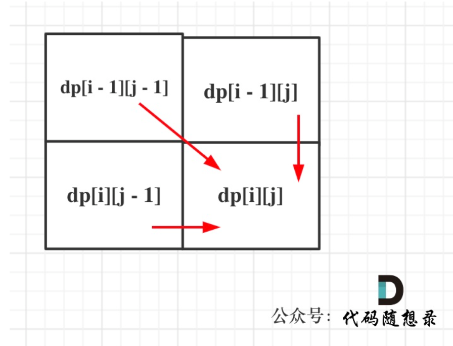

# 代码随想录算法训练营74期|动态规划part11

# 子序列系列

## 题目
| 题目     | Leetcode地址 |
| ----------- | ----------- |
|1143.最长公共子序列| [力扣题目链接](https://leetcode.cn/problems/longest-common-subsequence/description/)      |
|1035.不想交的线| [力扣题目链接](https://leetcode.cn/problems/uncrossed-lines/)      |
|53.最大子序和| [力扣题目链接](https://leetcode.cn/problems/maximum-subarray/description/)      |
|392.判断子序列| [力扣题目链接](https://leetcode.cn/problems/is-subsequence/)      |

### 1143.最长公共子序列
本题和动态规划：718. 最长重复子数组 (opens new window)区别在于这里不要求是连续的了，但要有相对顺序，即："ace" 是 "abcde" 的子序列，但 "aec" 不是 "abcde" 的子序列。

1. 确定dp数组（dp table）以及下标的含义
   dp[i][j]：长度为[0, i - 1]的字符串text1与长度为[0, j - 1]的字符串text2的最长公共子序列为dp[i][j]。有同学会问：为什么要定义长度为[0, i - 1]的字符串text1，定义为长度为[0, i]的字符串text1不香么？这样定义是为了后面代码实现方便，如果非要定义为长度为[0, i]的字符串text1也可以，我在 动态规划：718. 最长重复子数组 (opens new window)中的「拓展」里 详细讲解了区别所在，其实就是简化了dp数组第一行和第一列的初始化逻辑。

2. 确定递推公式
   主要就是两大情况： text1[i - 1] 与 text2[j - 1]相同，text1[i - 1] 与 text2[j - 1]不相同
   如果text1[i - 1] 与 text2[j - 1]相同，那么找到了一个公共元素，所以dp[i][j] = dp[i - 1][j - 1] + 1;如果text1[i - 1] 与 text2[j - 1]不相同，那就看看text1[0, i - 2]与text2[0, j - 1]的最长公共子序列 和 text1[0, i - 1]与text2[0, j - 2]的最长公共子序列，取最大的。即：dp[i][j] = max(dp[i - 1][j], dp[i][j - 1]);
3. dp数组如何初始化
   先看看dp[i][0]应该是多少呢？
   text1[0, i-1]和空串的最长公共子序列自然是0，所以dp[i][0] = 0;
   同理dp[0][j]也是0。其他下标都是随着递推公式逐步覆盖，初始为多少都可以，那么就统一初始为0。
4. 遍历顺序：
    

### 1035.不相交的线

本题和动态规划：1143. 最长公共子序列 (opens new window)几乎一模一样，只不过这里的两个数组本质上就是两个字符串而已。相信不少录友看到这道题目都没啥思路，我们来逐步分析一下。绘制一些连接两个数字 nums1[i] 和 nums2[j] 的直线，只要 nums1[i] == nums2[j]，且直线不能相交！直线不能相交，这就是说明在字符串nums1中 找到一个与字符串nums2相同的子序列，且这个子序列不能改变相对顺序，只要相对顺序不改变，连接相同数字的直线就不会相交。  

### 392.判断子序列
本题为编辑距离的入门题目，也可以使用双指针来解决，时间复杂度也是O(n)。
本题用动态规划来解决

本题与动态规划：1143. 最长公共子序列 (opens new window)非常类似，只不过这里我们只需要判断s是否为t的子序列，所以删除元素的应该只能是t中的元素，而不能删除s中的元素。也就是在dp数组回退的时候，只能从dp[i][j - 1]回退，而不能从dp[i - 1][j]回退。