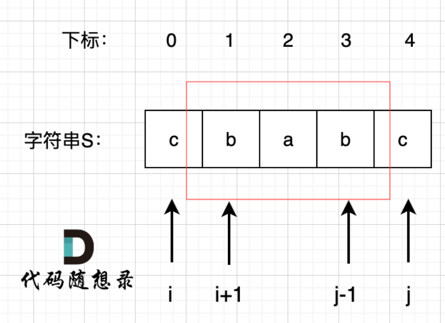
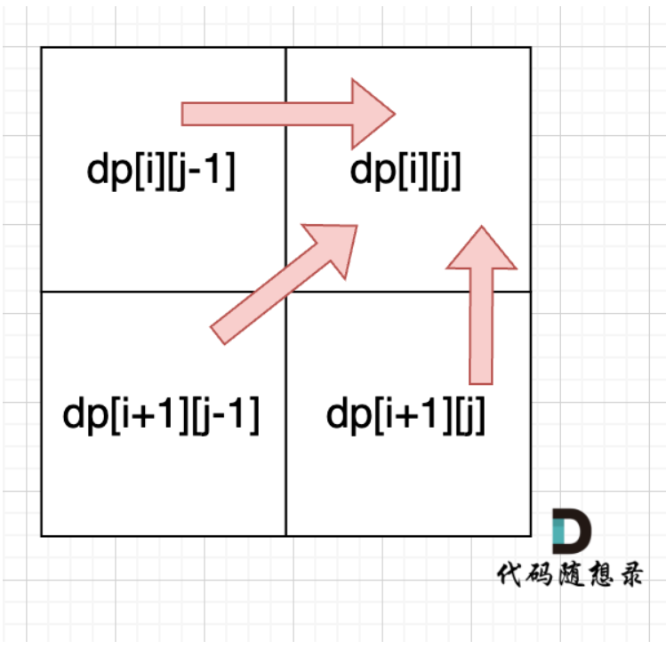
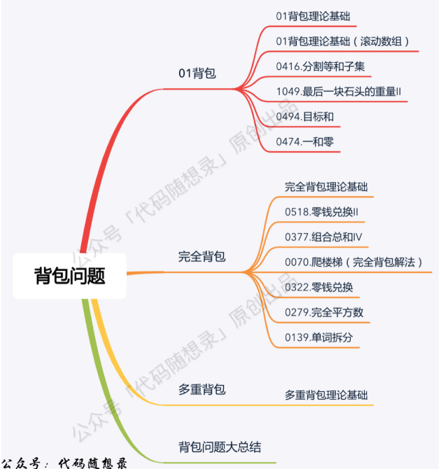
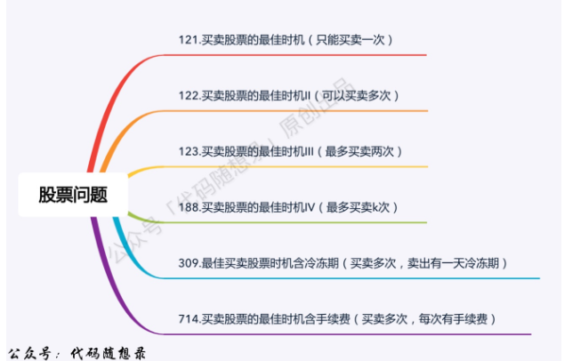
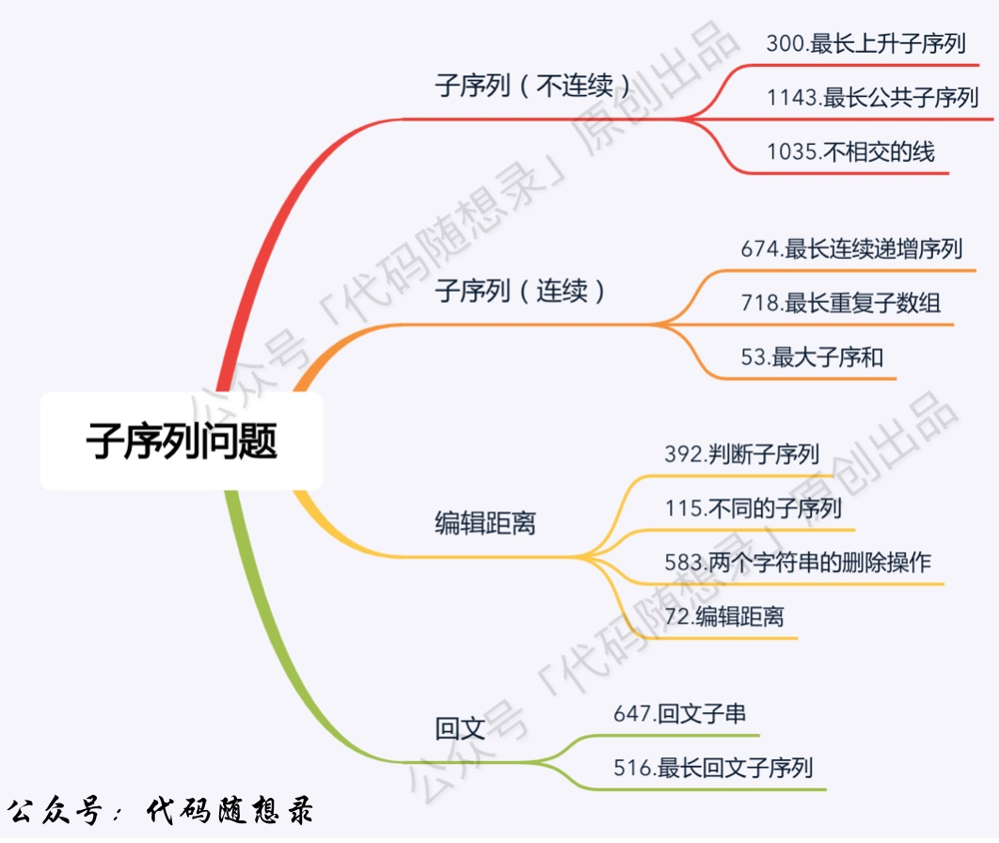

# 代码随想录算法训练营74期|动态规划part13

## 题目
| 题目     | Leetcode地址 |
| ----------- | ----------- |
|647.回文子串| [力扣题目链接](https://leetcode.cn/problems/palindromic-substrings/description/)      |
|516.最长回文子序列| [力扣题目链接](https://leetcode.cn/problems/longest-palindromic-subsequence/)      |

### 647.回文子串

暴力解法：双重循环遍历所有子串，然后判断是否为回文串，时间复杂度O(n^3)

动态规划：

1. 确定dp数组（dp table）以及下标的含义
如果大家做了很多这种子序列相关的题目，在定义dp数组的时候 很自然就会想题目求什么，我们就如何定义dp数组。
绝大多数题目确实是这样，不过本题如果我们定义，dp[i] 为下标i结尾的字符串有dp[i]个回文串的话，我们会发现很难找到递归关系。
dp[i] 和 dp[i-1] ，dp[i + 1] 看上去都没啥关系。
所以我们要看回文串的性质。 如图：

我们在判断字符串S是否是回文，那么如果我们知道 s[1]，s[2]，s[3] 这个子串是回文的，那么只需要比较 s[0]和s[4]这两个元素是否相同，如果相同的话，这个字符串s 就是回文串。
那么此时我们是不是能找到一种递归关系，也就是判断一个子字符串（字符串下标范围[i,j]）是否回文，依赖于，子字符串（下标范围[i + 1, j - 1]）） 是否是回文。
所以为了明确这种递归关系，我们的dp数组是要定义成一位二维dp数组。
布尔类型的dp[i][j]：表示区间范围[i,j] （注意是左闭右闭）的子串是否是回文子串，如果是dp[i][j]为true，否则为false。
2. 确定递推公式:
   当s[i]==s[j]时：
    - 下标i 与 j相同，同一个字符例如a，当然是回文子串
    - 下标i 与 j相差1，例如aa， 也是回文子串
    - 下标i 与 j相差大于1时，例如aba，此时就要看dp[i + 1][j - 1]是否为true了
   当s[i]!=s[j]时：直接赋值false
3. dp数组如何初始化：
   由于dp[i][j] 依赖于dp[i + 1][j - 1]，所以我们要从下往上遍历i，从左往右遍历j。
   同时要注意初始化对角线上的元素，因为单个字符肯定是回文子串，所以dp[i][i] = true,或者基于上述三种情况，直接初始化false也可以
4. 遍历顺序：
    由递推公式可以看出，是从下方和左下方推出来的，**所以i要从下往上遍历，j要从左往右遍历。**

### 516.最长回文子序列

动态规划：
1. 确定dp数组（dp table）以及下标的含义
dp[i][j]：表示字符串s在区间范围[i,j]（左闭右闭）内的最长回文子序列的长度为dp[i][j]。
2. 确定递推公式:
   这里就和上面的回文子串不一样了，只要i==j，那么就应该加2，而不是直接赋值true。
   如果s[i]与s[j]不相同，说明s[i]和s[j]的同时加入 并不能增加[i,j]区间回文子序列的长度，那么分别加入s[i]、s[j]看看哪一个可以组成最长的回文子序列：
   - 加入s[j]的回文子序列长度为dp[i + 1][j]。
   - 加入s[i]的回文子序列长度为dp[i][j - 1]。
- 那么dp[i][j]一定是取最大的，即：dp[i][j] = max(dp[i + 1][j], dp[i][j - 1]);
3. dp数组如何初始化：
   首先要考虑当i 和j 相同的情况，从递推公式：dp[i][j] = dp[i + 1][j - 1] + 2; 可以看出 递推公式是计算不到 i 和j相同时候的情况。
   所以需要手动初始化一下，当i与j相同，那么dp[i][j]一定是等于1的，即：一个字符的回文子序列长度就是1。
   其他情况dp[i][j]初始为0就行，这样递推公式：dp[i][j] = max(dp[i + 1][j], dp[i][j - 1]); 中dp[i][j]才不会被初始值覆盖。
4. 从递归公式中，可以看出，dp[i][j] 依赖于 dp[i + 1][j - 1] ，dp[i + 1][j] 和 dp[i][j - 1]，如图：

**所以遍历i的时候一定要从下到上遍历，这样才能保证下一行的数据是经过计算的。**

### 动态规划总结

#### 首先，至关重要的动归五部曲：

1. 确定dp数组（dp table）以及下标的含义
2. 确定递推公式
3. dp数组如何初始化
4. 确定遍历顺序
5. 举例推导dp数组

从简单的题去体会着五部，紧接着困难的题就会有思路去解决了。

#### 后面的题目：

##### 动态规划基础：

##### 背包问题系列：

##### 打家劫舍系列：
非线性的动态规划
##### 股票买卖系列：
不同状态的dp数组理解最深的地方，状态转移体现的最明显

##### 子序列问题
如何去理解，删除和删除那个，再有就是编辑距离了
