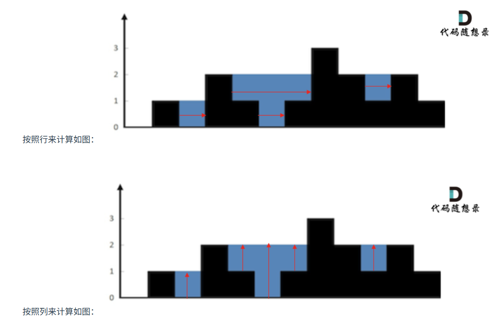

# 代码随想录算法训练营74期|单调栈part02

## 题目

| 题目     | Leetcode地址 |
| ----------- | ----------- |
|42.接雨水| [力扣题目链接](https://leetcode.cn/problems/trapping-rain-water/description/)      |
|84.柱状图中最大的矩形| [力扣题目链接](https://leetcode.cn/problems/largest-rectangle-in-histogram/description/)        |

### 42.接雨水

1. 暴力解法
   首先要明确，是按行计算还是按列计算。
   
   **如果按照列来计算的话，宽度一定是1了，我们再把每一列的雨水的高度求出来就可以了。**
   该列 左侧最高的柱子和右侧最高的柱子中最矮的那个柱子的高度 - 该列柱子的高度 = 该列的雨水高度。
   因为每次遍历列的时候，还要向两边寻找最高的列，所以时间复杂度为O(n^2)，空间复杂度为O(1)。
2. 双指针优化
   遍历的时候记录每一个位置的左边最高高度和右边最高高度，当前位置，左边的最高高度是前一个位置的左边最高高度和本高度的最大值。
   即从左向右遍历：maxLeft[i] = max(height[i], maxLeft[i - 1]);
   从右向左遍历：maxRight[i] = max(height[i], maxRight[i + 1]);
3. 单调栈解法
   1. 首先单调栈是按照行方向进行计算的
   2. 使用单调栈内元素的顺序：
       从小到大，应为我们要找的是出现凹槽的位置，因为一旦发现添加的柱子高度大于栈头元素了，此时就出现凹槽了，栈头元素就是凹槽底部的柱子，栈头第二个元素就是凹槽左边的柱子，而添加的元素就是凹槽右边的柱子。
    3. 遇到高度相同的柱子怎么办
       高度相同应该取最右边的柱子
    4.栈里面直接存下标即可

### 84.柱状图中最大的矩形
   本题要找每一个柱子左右两边的第一个小于他的柱子，所以应该从小到大
   题目代码可能比较抽象，我们要找的是当前的柱子，左边第一个小于它的柱子和右边第一个小于它的柱子。也就是说，在这个范围内，**它是最矮的柱子，所以它的高度决定了这个范围内矩形的高度，而宽度就是左右边界之间的距离减一。**