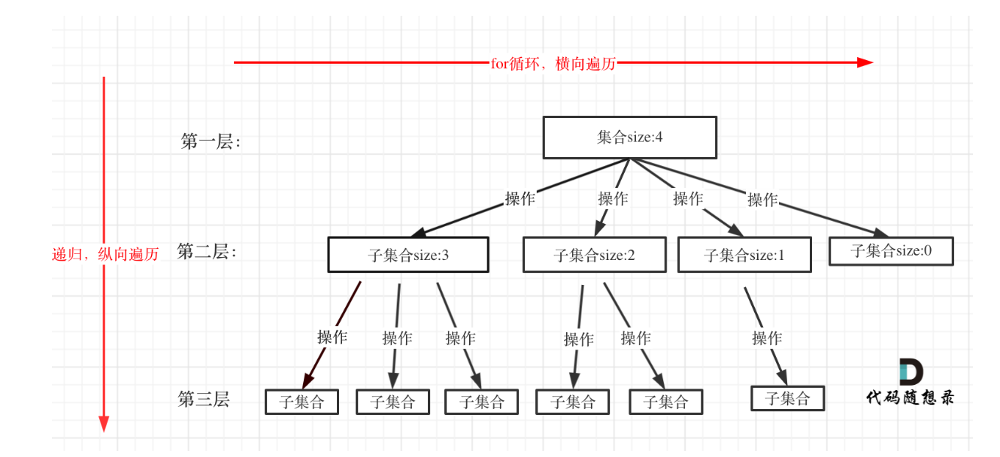
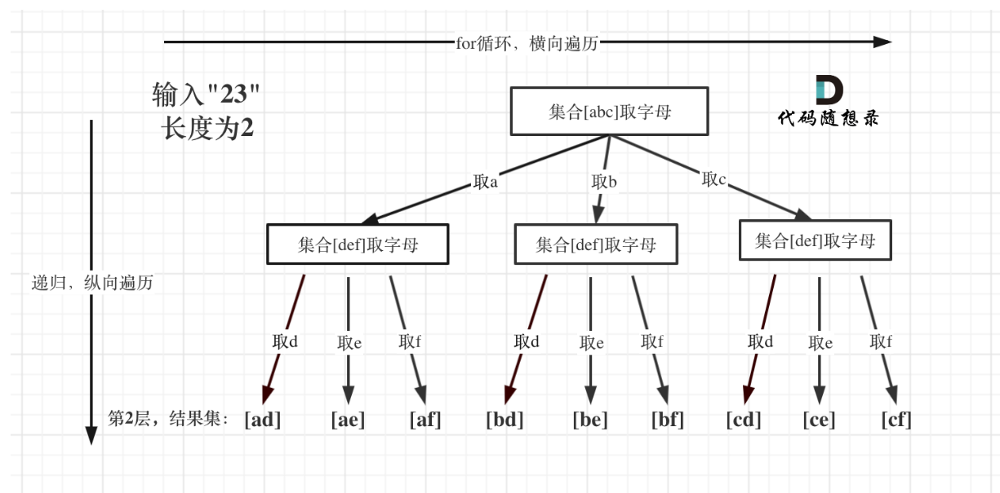

# 代码随想录算法训练营74期|回溯part01

## 理论基础

### 回溯法的定义

回溯法也称回溯递归法，是一种搜索方法，回溯是递归的副产品，指的是递归搜索后向前回找结果的过程，只要有递归就会有回溯

### 回溯法的效率

本质就是穷举，穷举所有可能找到想要的答案，但是这些答案中有很多是无效的，所以需要剪枝来提高效率，剪枝就是指在搜索过程中，提前排除一些不可能得到正确答案的分支，从而减少搜索空间，提高搜索效率。

### 回溯法的应用场景

回溯法一般应用于只能暴力搜索出来的问题，可以分为以下几类：

- 组合问题：从n个元素中选出k个元素的所有组合
- 切割问题：将一个字符串按照一定规则切割
- 子集问题：一个N个数的集合里有多少个符合条件的自子集
- 排列问题：N个数按一定规则全排列，有几种排列方式
- 棋盘问题：N皇后问题，数独问题等
  
### 如何理解回溯法

**回溯法的问题都可以抽象为属性结构**，结合大小为树的宽度，递归的深度为树的深度

### 回溯法模版

回溯三部曲：
- 回溯函数模版返回值以及参数：
  一般返回值为空，参数要根据逻辑来确定参数
  ```python
  void backTracking(参数)
  ```
- 回溯函数终止条件：
  找到正确的答案，保存，结束本层递归，返回
  ```python
    if (终止条件) {
        保存结果;
        return;
    }
    ```
- 回溯搜索的遍历过程：
  回溯法一般是在集合中递归搜索，集合的大小构成了树的宽度，递归的深度构成的树的深度
  
  回溯函数遍历过程
  ```python
    for (选择 : 选择列表) {
        做选择;
        backTracking(参数);
        撤销选择;
    }
  ```   
所以，回溯算法模版如下：
```python
void backTracking(参数) {
    if (终止条件) {
        保存结果;
        return;
    }
    for (选择 : 选择列表) { # 横向
        做选择;
        backTracking(参数); # 纵向
        撤销选择;
    }
}   
```

## 题目

| 题目     | Leetcode地址 |
| ----------- | ----------- |
| 77.组合 | [力扣题目链接](https://leetcode.cn/problems/combinations/)      |
| 216.组合总和III| [力扣题目链接](https://leetcode.cn/problems/combination-sum-iii/)      |
| 17.电话号码的字母组合| [力扣题目链接](https://leetcode.cn/problems/letter-combinations-of-a-phone-number/)      |

### 77.组合
为什么要用回溯：因为k不确定，循环次数不确定，需要穷举所有可能性
注意深浅拷贝的问题

### 216.组合总和III
和77类似

### 17.电话号码的字母组合

这道题不确定的k是电话号码的长度，所以应该将其作为递归的深度
如图：



### 总结
之所以用回溯法，是因为无法确定循环次数，需要穷举所有可能性，所以回溯法中不确定的就是递归的深度，所以应该与循环次数对应起来。长度固定的则是放到for循环中。在做题时，应该先找到递归的深度，再找到循环的宽度，从而确定回溯法的模版。可以画一个递归树来帮助理解。