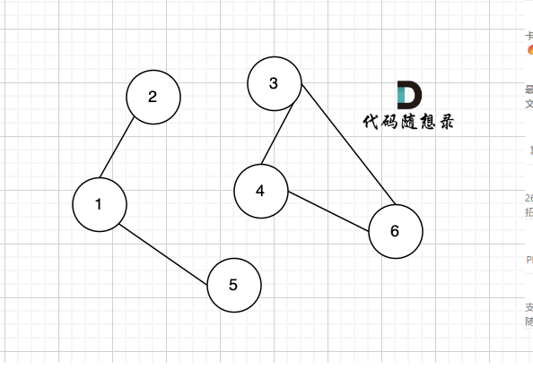
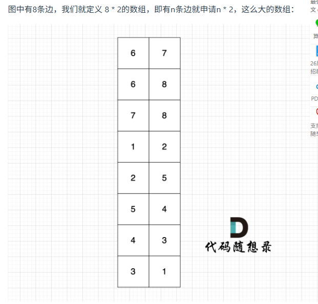
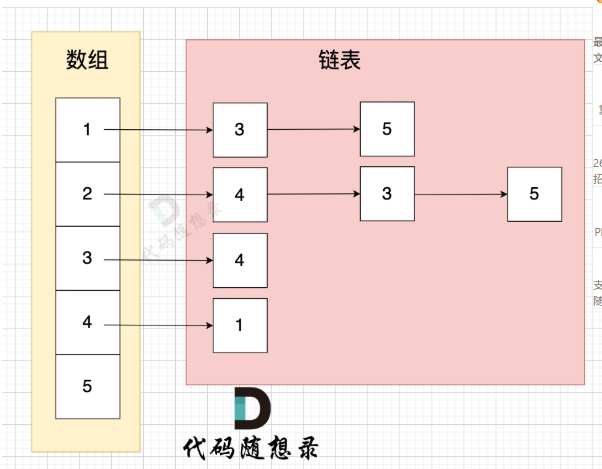

# 代码随想录算法训练营74期|图论part01

## 图的基本概念：

二维坐标中，两点可以连成线，多个点连成的线就构成了图。
当然图也可以就一个节点，甚至没有节点（空图）

### 图的种类
一般分为有向图和无向图（加权和不加权）

### 度

**无向图**中有几条边连接该节点，该节点就有几度。

**有向图**中，每个节点有出度和入度。
出度：从该节点出发的边的个数。
入度：指向该节点边的个数。

### 连通性

在图中表示节点的连通情况，我们称之为连通性。

#### 连通图

在**无向图**中，任何两个节点都是可以到达的，我们称之为连通图 
如果有节点不能到达其他节点，则为非连通图

#### 强连通图

在**有向图**中，任何两个节点是可以相互到达的，我们称之为 强连通图。

#### 联通分量

在**无向图**中的极大连通子图称之为该图的一个连通分量。


该无向图中 节点1、节点2、节点5 构成的子图就是 该无向图中的一个连通分量，该子图所有节点都是相互可达到的。
同理，节点3、节点4、节点6 构成的子图 也是该无向图中的一个连通分量。
那么无向图中 节点3 、节点4 构成的子图 是该无向图的联通分量吗？
不是！
因为必须是**极大联通子图**才能是连通分量，所以 必须是节点3、节点4、节点6 构成的子图才是连通分量。

#### 强联通分量
在有向图中极大强连通子图称之为该图的强连通分量。

### 图的构造

#### 朴素存储：
就是将所有边存下来：

#### 邻接矩阵

使用 二维数组来表示图结构。 邻接矩阵是从节点的角度来表示图，有多少节点就申请多大的二维数组。gird[i][j]表示 节点i 到 节点j 是否有边相连。

这种表达方式（邻接矩阵） 在 **边少，节点多**的情况下，会导致申请过大的二维数组，造成空间浪费。

在寻找节点连接情况的时候，需要遍历整个矩阵，即 n * n 的时间复杂度，同样造成时间浪费。

#### 邻接表

邻接表 使用 数组 + 链表的方式来表示。 邻接表是从边的数量来表示图，有多少边 才会申请对应大小的链表。

这里表达的图是：
 - 节点1 指向 节点3 和 节点5
 - 节点2 指向 节点4、节点3、节点5
 - 节点3 指向 节点4
 - 节点4指向节点1

### 图的遍历方式

深度优先和广度优先（其实树就可以看成一种特殊的图）

#### 深度优先搜索 DFS
dfs是可一个方向去搜，不到黄河不回头，直到遇到绝境了，搜不下去了，再换方向（换方向的过程就涉及到了回溯）。
- 搜索方向，是认准一个方向搜，直到碰壁之后再换方向
- 换方向是撤销原路径，改为节点链接的下一个路径，回溯的过程。

代码框架：
```c++
void dfs(参数) {
    处理节点
    dfs(图，选择的节点); // 递归
    回溯，撤销处理结果
}
```

深搜三部曲

1. 确认递归函数，参数
   通常我们递归的时候，我们递归搜索需要了解哪些参数，其实也可以在写递归函数的时候，发现需要什么参数，再去补充就可以。
   一般情况，深搜需要 二维数组数组结构保存所有路径，需要一维数组保存单一路径，这种保存结果的数组，我们可以定义一个全局变量，避免让我们的函数参数过多。
2. 确认终止条件
3. 处理目前搜索节点出发的路径
   一般这里就是一个for循环的操作，去遍历 目前搜索节点 所能到的所有节点。

#### 题目

[所有可达路径ACM形式](https://kamacoder.com/problempage.php?pid=1170)

#### 广度优先搜索 BFS
广搜的搜索方式就适合于解决两个点之间的最短路径问题。

因为广搜是从起点出发，以起始点为中心一圈一圈进行搜索，一旦遇到终点，记录之前走过的节点就是一条最短路。

当然，也有一些问题是广搜 和 深搜都可以解决的，例如岛屿问题，这类问题的特征就是不涉及具体的遍历方式，只要能把相邻且相同属性的节点标记上就行。 （我们会在具体题目讲解中详细来说）

广搜可以用 队列 来实现。
代码框架：
```c++
int dir[4][2] = {0, 1, 1, 0, -1, 0, 0, -1}; // 表示四个方向
// grid 是地图，也就是一个二维数组
// visited标记访问过的节点，不要重复访问
// x,y 表示开始搜索节点的下标
void bfs(vector<vector<char>>& grid, vector<vector<bool>>& visited, int x, int y) {
    queue<pair<int, int>> que; // 定义队列
    que.push({x, y}); // 起始节点加入队列
    visited[x][y] = true; // 只要加入队列，立刻标记为访问过的节点
    while(!que.empty()) { // 开始遍历队列里的元素
        pair<int ,int> cur = que.front(); que.pop(); // 从队列取元素
        int curx = cur.first;
        int cury = cur.second; // 当前节点坐标
        for (int i = 0; i < 4; i++) { // 开始想当前节点的四个方向左右上下去遍历
            int nextx = curx + dir[i][0];
            int nexty = cury + dir[i][1]; // 获取周边四个方向的坐标
            if (nextx < 0 || nextx >= grid.size() || nexty < 0 || nexty >= grid[0].size()) continue;  // 坐标越界了，直接跳过
            if (!visited[nextx][nexty]) { // 如果节点没被访问过
                que.push({nextx, nexty});  // 队列添加该节点为下一轮要遍历的节点
                visited[nextx][nexty] = true; // 只要加入队列立刻标记，避免重复访问
            }
        }
    }

}
```