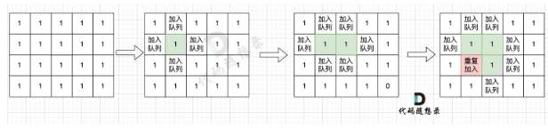

# 代码随想录算法训练营74期|图论part02

## 题目
| 题目     | 地址 |
| ----------- | ----------- |
|99.岛屿数量 | [卡码题目链接](https://kamacoder.com/problempage.php?pid=1171)      |
|100.岛屿的最大面积| [卡玛题目链接](https://kamacoder.com/problempage.php?pid=1172)      |

## 99.岛屿数量

注意，本题中每座岛屿只能由水平或竖直方向上的相邻的陆地链接而成

这道题题目是** DFS，BFS，并查集**，基础题目
基本思路是：遇到一个没有遍历过的节点的陆地，计数器就加1，然后把和这个节点相连的所有陆地都标记为遍历过。遇到遍历过的陆地和海洋直接跳过。
**关键点：如何把节点陆地所能遍历到的陆地都标记上**
### DFS解法
```c++
int dir[4][2] = {0, 1, 1, 0, -1, 0, 0, -1}; // 四个方向
void dfs(const vector<vector<int>>& grid, vector<vector<bool>>& visited, int x, int y) {
    for (int i = 0; i < 4; i++) {
        int nextx = x + dir[i][0];
        int nexty = y + dir[i][1];
        if (nextx < 0 || nextx >= grid.size() || nexty < 0 || nexty >= grid[0].size()) continue;  // 越界了，直接跳过
        if (!visited[nextx][nexty] && grid[nextx][nexty] == 1) { // 没有访问过的 同时 是陆地的

            visited[nextx][nexty] = true;
            dfs(grid, visited, nextx, nexty);
        }
    }
}

int main() {
    int n, m;
    cin >> n >> m;
    vector<vector<int>> grid(n, vector<int>(m, 0));
    for (int i = 0; i < n; i++) {
        for (int j = 0; j < m; j++) {
            cin >> grid[i][j];
        }
    }

    vector<vector<bool>> visited(n, vector<bool>(m, false));

    int result = 0;
    for (int i = 0; i < n; i++) {
        for (int j = 0; j < m; j++) {
            if (!visited[i][j] && grid[i][j] == 1) {
                visited[i][j] = true;
                result++; // 遇到没访问过的陆地，+1
                dfs(grid, visited, i, j); // 将与其链接的陆地都标记上 true
            }
        }
    }

    cout << result << endl;
}
```
上述是解法1，没有发现递归出口，其实是判断了符合条件的节点才会进入递归，所以不符合条件的节点就相当于递归出口。这也就是所谓的隐式递归出口。
当然还可以加上显式递归出口：
```c++
#include <iostream>
#include <vector>
using namespace std;
int dir[4][2] = {0, 1, 1, 0, -1, 0, 0, -1}; // 四个方向
void dfs(const vector<vector<int>>& grid, vector<vector<bool>>& visited, int x, int y) {
    if (visited[x][y] || grid[x][y] == 0) return; // 终止条件：访问过的节点 或者 遇到海水
    visited[x][y] = true; // 标记访问过
    for (int i = 0; i < 4; i++) {
        int nextx = x + dir[i][0];
        int nexty = y + dir[i][1];
        if (nextx < 0 || nextx >= grid.size() || nexty < 0 || nexty >= grid[0].size()) continue;  // 越界了，直接跳过
        dfs(grid, visited, nextx, nexty);
    }
}

int main() {
    int n, m;
    cin >> n >> m;
    vector<vector<int>> grid(n, vector<int>(m, 0));
    for (int i = 0; i < n; i++) {
        for (int j = 0; j < m; j++) {
            cin >> grid[i][j];
        }
    }

    vector<vector<bool>> visited(n, vector<bool>(m, false));

    int result = 0;
    for (int i = 0; i < n; i++) {
        for (int j = 0; j < m; j++) {
            if (!visited[i][j] && grid[i][j] == 1) {
                result++; // 遇到没访问过的陆地，+1
                dfs(grid, visited, i, j); // 将与其链接的陆地都标记上 true
            }
        }
    }
    cout << result << endl;
```
### BFS解法

用广搜做这道题目的时候，超时了。 这里有一个广搜中很重要的细节：

根本原因是**只要 加入队列就代表 走过，就需要标记，而不是从队列拿出来的时候再去标记走过。**如果从队列拿出节点，再去标记这个节点走过，就会发生下图所示的结果，会导致很多节点重复加入队列：


## 100.岛屿的最大面积
