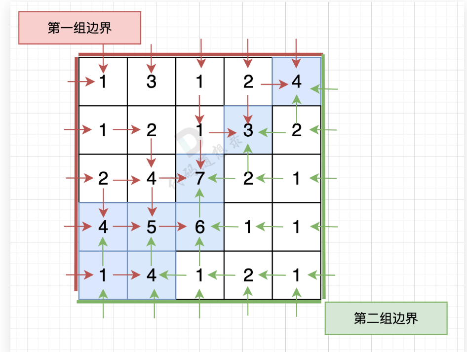
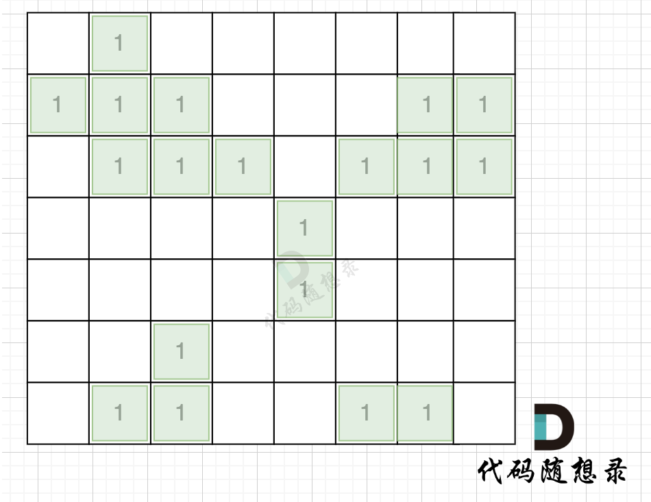
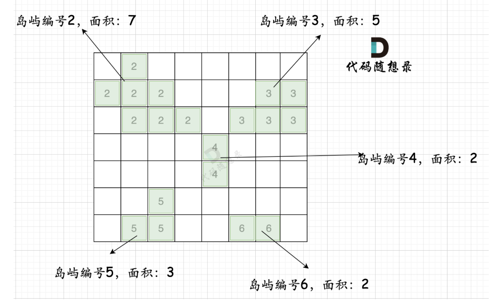
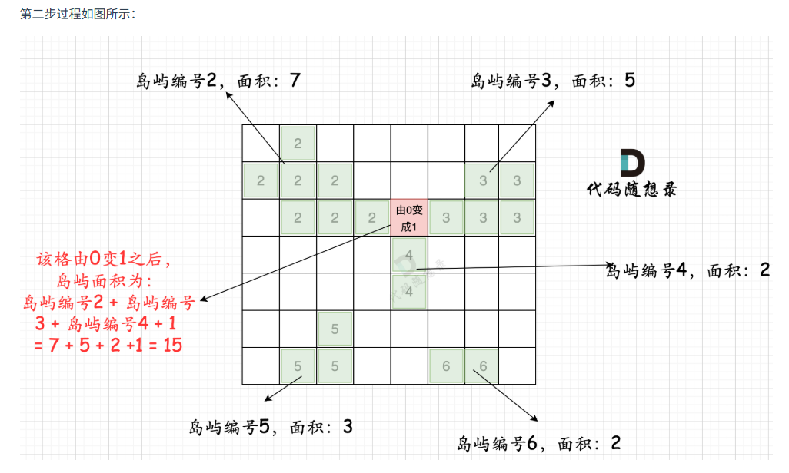

# 代码随想录算法训练营74期|图论part03

## 题目
| 题目     | 地址 |
| ----------- | ----------- |
|101.孤岛的总面积 | [卡码题目链接](https://kamacoder.com/problempage.php?pid=1173)      |
|102.沉没孤岛| [卡码题目链接](https://kamacoder.com/problempage.php?pid=1174)      |
|103.水流问题| [卡码题目链接](https://kamacoder.com/problempage.php?pid=1175)      |
|104.建造最大岛屿| [卡码题目链接](https://kamacoder.com/problempage.php?pid=1176)      |

### 103.水流问题
现有一个 N × M 的矩阵，每个单元格包含一个数值，这个数值代表该位置的相对高度。矩阵的左边界和上边界被认为是第一组边界，而矩阵的右边界和下边界被视为第二组边界。

矩阵模拟了一个地形，当雨水落在上面时，水会根据地形的倾斜向低处流动，但只能从较高或等高的地点流向较低或等高并且相邻（上下左右方向）的地点。我们的目标是确定那些单元格，从这些单元格出发的水可以达到第一组边界和第二组边界。

一个比较直白的想法，其实就是 遍历每个点，然后看这个点 能不能同时到达第一组边界和第二组边界。至于遍历方式，可以用dfs，也可以用bfs，以下用dfs来举例。

这种思路很直白，但很明显，以上代码超时了。 来看看时间复杂度。

遍历每一个节点，是 m * n，遍历每一个节点的时候，都要做深搜，深搜的时间复杂度是： m * n

那么整体时间复杂度 就是 O(m^2 * n^2) ，这是一个四次方的时间复杂度。

**优化**

那么我们可以 反过来想，从第一组边界上的节点 逆流而上，将遍历过的节点都标记上。
同样从第二组边界的边上节点 逆流而上，将遍历过的节点也标记上。
然后两方都标记过的节点就是既可以流向第一组边界也可以流向第二组边界的节点。
从第一组边界边上节点出发，如图： （图中并没有把所有遍历的方向都画出来，只画关键部分）
从第二组边界上节点出发，如图： （图中并没有把所有遍历的方向都画出来，只画关键部分）

大家再自己看 dfs函数的实现，其实 有visited函数记录 走过的节点，而走过的节点是不会再走第二次的。

所以 调用dfs函数，只要参数传入的是 数组 firstBorder，那么地图中 每一个节点其实就遍历一次，无论你调用多少次。

同理，调用dfs函数，只要 参数传入的是 数组 secondBorder，地图中每个节点也只会遍历一次。

所以，以下这段代码的时间复杂度是 2 * n * m。 地图用每个节点就遍历了两次，参数传入 firstBorder 的时候遍历一次，参数传入 secondBorder 的时候遍历一次。

### 104.建造最大岛屿
本题的一个暴力想法，应该是遍历地图尝试 将每一个 0 改成1，然后去搜索地图中的最大的岛屿面积。

计算地图的最大面积：遍历地图 + 深搜岛屿，时间复杂度为 n * n。

（其实使用深搜还是广搜都是可以的，其目的就是遍历岛屿做一个标记，相当于染色，那么使用哪个遍历方式都行，以下我用深搜来讲解）

每改变一个0的方格，都需要重新计算一个地图的最大面积，所以 整体时间复杂度为：n^4。
**优化**
其实每次深搜遍历计算最大岛屿面积，我们都做了很多重复的工作。

只要用一次深搜把每个岛屿的面积记录下来就好。

第一步：一次遍历地图，得出各个岛屿的面积，并做编号记录。可以使用map记录，key为岛屿编号，value为岛屿面积

第二步：再遍历地图，遍历0的方格（因为要将0变成1），并统计该1（由0变成的1）周边岛屿面积，将其相邻面积相加在一起，遍历所有 0 之后，就可以得出 选一个0变成1 之后的最大面积。
如图：

也就是遍历每一个0的方格，并统计其相邻岛屿面积，最后取一个最大值。

这个过程的时间复杂度也为 n * n。

所以整个解法的时间复杂度，为 n * n + n * n 也就是 n^2。

当然这里还有一个优化的点，就是 可以不用 visited数组，因为有mark来标记，所以遍历过的grid[i][j]是不等于1的。