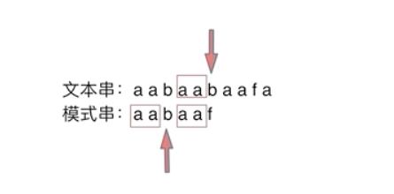

# 代码随想录算法训练营74期|字符串part01

| 题目     | Leetcode地址 |
| ----------- | ----------- |
|151.翻转字符串里的单词 | [力扣题目链接](https://leetcode.cn/problems/reverse-words-in-a-string/)    |
|55.右旋转字符串 | [卡码网题目链接](https://kamacoder.com/problempage.php?pid=1065)    |
|*28.找出字符串中第一个匹配项的下标(KMP) | [力扣题目链接](https://leetcode.cn/problems/find-the-index-of-the-first-occurrence-in-a-string/description/)    |
|459.重复的子字符串| [力扣题目链接](https://leetcode.cn/problems/repeated-substring-pattern/description/)    |


## KMP算法

### KMP思想
为什么用KMP算法：在字符串匹配的过程中，如果出现不符合的情况，就需要从头再比，但是**KMP可以记录一下之前已经匹配的内容，从而不用从头去匹配，从不同的地方匹配即可**
要实现这个策略，KMP引入了一种了新的数据结构next数组，来表示前缀表，用于回退，记录模式串与主串不匹配时，模式串应该从哪开始重新匹配
举例说：文本串：aabaabaafa 中查找是否出现过一个模式串：aabaaf

在上图的情况，b和f不匹配了，但是f前的aa已经匹配成功了，同时，f前的aa又和模式串开始的aa相同，所以，进行回退的时候就不需要一步步回退了，aa已经比较过相同了，我们只需继续比较aa后面不同的元素即可了，也就是如下图的情况：

所以 next数组就是用来记录回退的位置，而回退的位置就相当于末尾有多少个元素与开头相同，这也就是所谓的前缀表数组（**记录下标i之前（包括i）的字符串中，有多大长度的相同前缀后缀。**）。**前缀表的任务是**当前位置匹配失败，找到之前已经匹配上的位置，再重新匹配，此也意味着在某个字符失配时，前缀表会告诉你下一步匹配中，模式串应该跳到哪个位置。


找到的不匹配的位置， 那么此时我们要看它的前一个字符的前缀表的数值是多少。因为要找前面字符串的最长相同的前缀和后缀。

### next数组计算
1. 初始化
定义两个指针i和j，j指向前缀末尾，i指向后缀末尾
next[i]就表示i之前最长相等的前后缀长度（也就是j）
2. 处理前后缀不相同的情况
```python 
for i in range(1, len(s)):
if s[i] != s[j + 1]:
```
next[j]就是记录着j（包括j）之前的子串的相同前后缀的长度。
那么 s[i] 与 s[j+1] 不相同，就要找 j+1前一个元素在next数组里的值（这里还是使用了KMP的思想，不匹配就去找前一个元素），所以代码中求next数组和kmp的代码非常相似，要注意不同的细节
```python
while j > 0 and s[i] != s[j + 1]:
    j = next[j]
```
3.处理前后缀相同的情况
相同就继续向下，并且记录next[j + 1]（j:前缀的长度）
```python
if s[i] ==
    j++
next[i] = j
```

为什么要比j + 1因为我们需要回退的是，不匹配前一个元素，所以应该是j+1回退j

### 实现中的问题：

注意区分KMP和求Next数组的细微差别
同时，注意一定要按照上述的逻辑顺序去验证，否则会出现漏解错解的情况

## 总结
双指针法是字符串处理的常客。KMP算法是字符串查找最重要的算法，双指针方法也是非常常见的，可以将整个题目的复杂度降低一个数量级，具体总结[详见](https://programmercarl.com/%E5%8F%8C%E6%8C%87%E9%92%88%E6%80%BB%E7%BB%93.html)


