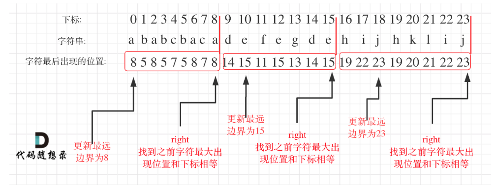

# 代码随想录算法训练营74期|贪心算法part04

## 题目
| 题目     | Leetcode地址 |
| ----------- | ----------- |
| 452.用最少数量的箭引爆气球 | [力扣题目链接](https://leetcode.cn/problems/minimum-number-of-arrows-to-burst-balloons/description/)      |
| 135.分发糖果 | [力扣题目链接](https://leetcode.cn/problems/candy/description/)      |
| 763.划分字母区间 | [力扣题目链接](https://leetcode.cn/problems/partition-labels/description/)      |

## 452.用最少数量的箭引爆气球

本题其实就是找重复区间，只要每个气球重复到一起，就能一同扎破。
先按开始排序，然后记录右边界来判断重合的区域有几个，即最少的箭
局部最优：当气球出现重叠，一起射，所用弓箭最少。全局最优：把所有气球射爆所用弓箭最少。

python关键词排序：
```python 
points.sort(key=lambda x: x[0])
```

## 453.
本题和上题类似都是找重叠区间，
自己的想法是，先按左排序，然后碰到重叠就+1
但这样不是最优解，因为像[1,100] [1,11],[2,12],[11,22],按照这种方法就会被1-100覆盖，从而多删除一个
所以用这种方法就应该先按左排序，再按右排序
或者每次更新右边界选取最小的，也就是答案中的写法。

当然，也可以找非独立区间，像452一样，再用总区间区间，就是重复的区间

## 763.

在遍历的过程中相当于是要找每一个字母的边界，如果找到之前遍历过的所有字母的最远边界，说明这个边界就是分割点了。此时前面出现过所有字母，最远也就到这个边界了。


